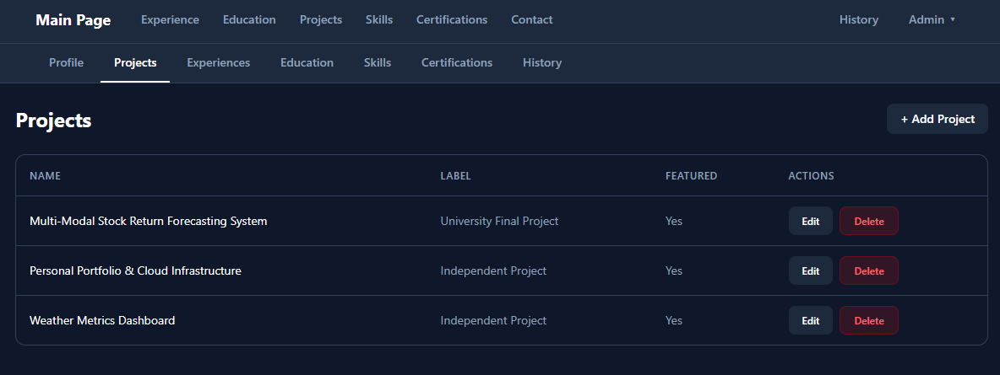
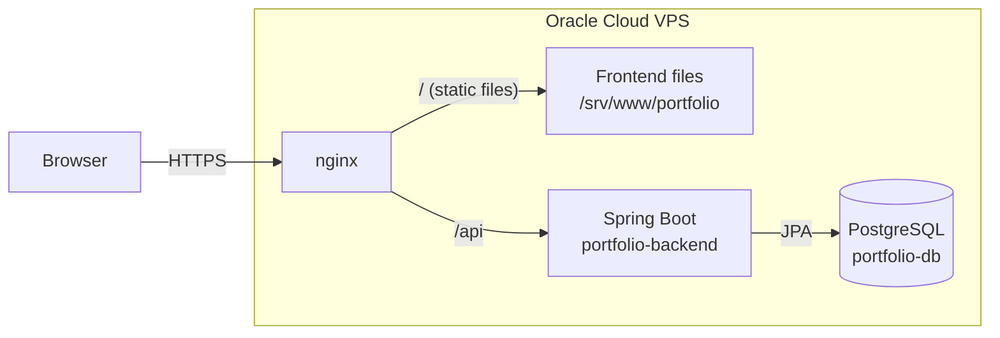

# Portfolio Application

A personal portfolio website with an admin panel. A Spring Boot REST API stores the content in PostgreSQL, and a React frontend displays it. All content can be edited from the admin panel without changing code or redeploying.

The website has the following sections:
- **Profile**: personal details, shown in two sections:
   - About: name, headline, biography and GitHub/LinkedIn buttons
   - Contact: email, LinkedIn and GitHub buttons
- **Experience**: work experience on a timeline, with a card for each position showing the role, company, dates, location and main responsibilities
- **Education**: a card for each degree, with the institution, field of study, dates and location
- **Projects**: a card for each project, with a description, the technologies used, and links to the live version and the source code
   - Filters: featured projects or all projects
- **Skills**: technical skills grouped by category, one card per category
   - Example: "Cloud & DevOps" lists AWS, Docker, Git and Linux
- **Certifications**: a card for each certificate, with the issuer, date and a button to verify the credential when a link is set
- **History**: a timeline of changes and milestones, on its own page at `/history`, with a card for each entry

## Live Links

- **Website**: [https://vg-portfolio.duckdns.org](https://vg-portfolio.duckdns.org)
   - Admin panel: `/admin` (login required)
   - History: `/history`
- **API**: [https://vg-portfolio.duckdns.org/api/profile](https://vg-portfolio.duckdns.org/api/profile)
   - Public (`GET`): `/api/profile`, `/api/projects`, `/api/experiences`, `/api/educations`, `/api/skills`, `/api/certifications`, `/api/history`
      - A single item by its ID, for every resource except the profile: `/api/<resource>/{id}`
      - Example: [`/api/skills/1`](https://vg-portfolio.duckdns.org/api/skills/1)
   - Admin only (`POST`, `PUT`, `DELETE`): the same resources
   - Health check: `/actuator/health`
- **Source code**: [github.com/v-galkin/portfolio-app](https://github.com/v-galkin/portfolio-app)

## Screenshots




## Tech Stack

**Backend**
- **Java 21** + **Spring Boot 3.5**: the REST API
- **Spring Security**: admin login with a session cookie, and protection of all write endpoints
- **Spring Data JPA** + **Hibernate**: maps the database tables to Java entities
- **Flyway**: versioned database migrations that create and update the schema
- **PostgreSQL 16**: stores all website content
- **Spring Boot Actuator**: the `/actuator/health` endpoint used by the Docker health check
- **JUnit 5**, **Mockito** + **H2**: the automated test suite, run against an in-memory database

**Frontend**
- **React 19** + **TypeScript**: the public website and the admin panel
- **Vite**: development server and production build
- **Tailwind CSS 4**: styling
- **React Router**: client-side routing for `/`, `/admin` and `/history`
- **axios**: HTTP client for the API
- **ESLint**: lints the frontend code

**Infrastructure**
- **Docker** + **Docker Compose**: run the backend and the database as containers
- **nginx**: reverse proxy on the VPS, shared across multiple projects. Also serves the frontend files
- **GitHub Actions**: runs the tests, lint and build on every push and pull request, and builds, pushes and deploys on pushes to `main`
- **GitHub Container Registry (`ghcr.io`)**: stores the backend image built by the pipeline, which the VPS pulls on deploy
- **Oracle Cloud VPS**: free-tier server that hosts the application, the database and nginx
- **Let's Encrypt** + **Certbot**: issue the TLS certificate that serves the site over HTTPS
- **DuckDNS**: free domain name that points to the VPS

## Flow Chart

The diagram below shows how a request reaches the application. It does not include the CI/CD pipeline or the other projects that share the server.



## Design Decisions

### No container for the frontend
After the build, the frontend is only static files (HTML, JavaScript and CSS). It doesn't need a running process, because nginx already serves files. The build is copied to `/srv/www/portfolio` on the server, and the shared nginx serves it from there. This saves memory on the server and makes a frontend deploy a simple file copy.

### Admin login with a session cookie
The admin panel logs in once (`POST /api/auth/login`), and the backend returns a session cookie. The cookie is `HttpOnly`, so JavaScript cannot read it, and `SameSite=Strict`, so the browser does not send it with requests from other sites. The password is never stored in the browser. The session expires after 2 hours, and `POST /api/auth/logout` ends it. HTTP Basic authentication still works for single requests, for example with `curl`.

### Brute-force protection
After 5 failed logins from the same IP address within 15 minutes, that IP is blocked for 15 minutes and receives `429 Too Many Requests`. The backend runs behind nginx, so it reads the client IP from the `X-Forwarded-For` header. It only trusts that header from proxies on private networks (such as the Docker network), so a client cannot fake its IP address.

### Flyway owns the database schema
The schema is created and changed only by the Flyway migrations in `backend/src/main/resources/db/migration`. Hibernate runs with `ddl-auto=validate`: it checks that the entities match the tables, but never changes the database. Migrations that have already been applied are never edited, because Flyway stores a checksum of each file and refuses to start if one changes.

### Limited memory use
The server has only 1 GB of RAM and also runs other applications. The backend container is limited to 512 MB (`mem_limit`), and the JVM uses at most 75% of it (`-XX:MaxRAMPercentage=75.0`). With this limit, the backend takes about 2 minutes to start. The Docker health check therefore waits 180 seconds before failed checks count, so the container is not marked unhealthy while it is still starting.

### Tests use an in-memory database
The backend has 141 tests. They run against an H2 in-memory database with the `test` profile, so they need neither PostgreSQL nor Docker.

The tests cover:

- **Services**
  - create, read, update and delete for each resource
  - a `ResourceNotFoundException` for an unknown ID
  - updating the profile while keeping its ID
- **Controllers**
  - every endpoint returning the correct status code and JSON
  - invalid input returning `400` with the field errors
- **Security**
  - write requests returning `401` without credentials or with wrong ones
  - read requests working without login
  - the login session: logging in, `/api/auth/me` and logging out
  - an IP being blocked after 5 failed logins
  - the application refusing to start without admin credentials
- **Configuration**
  - CORS allowing only the configured origins
  - `400` and `404` errors using the common JSON format, including invalid JSON and unknown paths
  - the session cookie being `HttpOnly` and `SameSite=Strict`, and public or rejected requests not creating sessions
  - `/actuator/health` being public and returning no details, and the other Actuator endpoints staying hidden

## CI/CD

Every push and pull request to `main` triggers a GitHub Actions pipeline (`.github/workflows/ci-cd.yml`) with four jobs:

1. **`backend-test`**: runs the backend test suite (`./mvnw test`).
2. **`frontend-check`**: runs `npm run lint` and `npm run build`, in parallel with `backend-test`. The build output is saved for the deploy job.
3. **`build-and-push`**: only runs on a push to `main` (not on pull requests), and only if both checks succeed. Builds the backend Docker image and pushes it to GitHub Container Registry (`ghcr.io`), tagged `latest` and with the commit SHA, which is used for rollbacks.
4. **`deploy`**: runs after `build-and-push`, on pushes to `main` only. Connects to the VPS over SSH and:
   - pulls the latest repo and backend image, and recreates the backend container with `docker compose`
   - waits until the backend reports `healthy`, and fails with the backend logs if it doesn't within 5 minutes
   - copies the frontend build to `/srv/www/portfolio` with `rsync`
   - checks that the website and `/api/profile` respond

The backend is deployed before the frontend, so if it fails, the previous frontend keeps working with the previous backend. Changes to Markdown files only (such as this README) do not trigger the pipeline.

The VPS pulls the published `ghcr.io` image, so the server never builds anything itself. The deploy job connects over SSH using credentials stored as GitHub Actions secrets:
- `VPS_SSH_KEY`
- `VPS_HOST`
- `VPS_USER`

For each deploy, the server logs in to `ghcr.io` with a short-lived token from the pipeline and logs out after pulling, so no registry credentials are stored on the server. The admin credentials and the database password live only in a `.env` file on the server and are never committed to the repository.

## Deployment

### One-time server setup
The pipeline expects the following on the server:
1. **Repository**: cloned at `~/portfolio-app` over SSH (`git@github.com:v-galkin/portfolio-app.git`).
2. **`.env` file**: next to `docker-compose.yml`, with `ADMIN_USERNAME`, `ADMIN_PASSWORD`, `POSTGRES_PASSWORD` and `CORS_ALLOWED_ORIGINS`.
3. **Docker network**: `portfolio-network` exists and is shared with nginx.
4. **Frontend folder**: `/srv/www/portfolio`, owned by the deploy user and mounted read-only into the nginx container at `/usr/share/nginx/html/portfolio`.
5. **nginx**: the portfolio server block has two locations:
   - `location /` serves the frontend folder with `try_files $uri $uri/ /index.html`, so routes such as `/admin` load the React app
   - `location /api` forwards requests to `portfolio-backend:8080` and sets the `X-Forwarded-For` and `X-Forwarded-Proto` headers. The backend needs them for the client IP (brute-force protection) and to mark the session cookie as `Secure`
6. **Deploy key**: the public part of the `VPS_SSH_KEY` key is in the deploy user's `~/.ssh/authorized_keys`.

### Manual deploy
If GitHub Actions is unavailable, both parts can be deployed by hand.

Frontend (built locally and copied to the server with `rsync`):
```bash
cd frontend
npm ci
npm run build
rsync -az --delete dist/ ubuntu@<server>:/srv/www/portfolio/
```
Backend (on the server, builds the image locally instead of pulling it):
```bash
cd ~/portfolio-app
git pull
docker compose up -d --build portfolio-db portfolio-backend
```

### Rollback
Every deploy also tags the backend image with its commit SHA, so an earlier version can be restored. The image is private, so pulling it by hand requires logging in to `ghcr.io` with a GitHub token that has the `read:packages` scope:
```bash
cd ~/portfolio-app
git checkout <good-commit-sha>
docker login ghcr.io
docker pull ghcr.io/v-galkin/portfolio-app-backend:<good-commit-sha>
docker tag ghcr.io/v-galkin/portfolio-app-backend:<good-commit-sha> ghcr.io/v-galkin/portfolio-app-backend:latest
docker compose up -d portfolio-backend
docker logout ghcr.io
```
Run `git switch main` before the next deploy. Otherwise `git pull` in the pipeline fails, because the repository is not on a branch.

Flyway migrations only add to the schema, so older backend versions keep working with a newer database. Before a release that changes the schema, take a backup:
```bash
docker exec portfolio-db pg_dump -U portfolio_user portfolio > ~/portfolio-backup-$(date +%F).sql
```

## Running Locally

You need:
- **Java 21**
- **Node.js 22**
- **Docker**

The database runs in Docker in both options below. Create a `.env` file in the project root:
```ini
ADMIN_USERNAME=example_username
ADMIN_PASSWORD=example_password
POSTGRES_PASSWORD=example_db_password
CORS_ALLOWED_ORIGINS=http://localhost:5173
```

The containers join the `portfolio-network` Docker network, which is shared with nginx on the server. Create it once:
```bash
docker network create portfolio-network
```

The main `docker-compose.yml` does not publish any ports, because on the server only nginx needs to reach the containers. For local development, create a `docker-compose.override.yml` file in the project root (it is ignored by git). Docker Compose merges it automatically:
```yaml
services:
  portfolio-db:
    ports:
      - "5433:5432"
  portfolio-backend:
    ports:
      - "8080:8080"
```

On the first start, Flyway creates the tables and fills them with sample content.

### Option 1: Docker Compose (database and backend)
1. Start the containers:
   ```bash
   docker compose up -d --build
   ```
   The backend is ready when `docker compose ps` shows it as `healthy`.
2. Start the frontend:
   ```bash
   cd frontend
   npm ci
   npm run dev
   ```
3. Open the services:
   - Website: `http://localhost:5173` (the admin panel is at `/admin`, with the credentials from `.env`)
   - API: `http://localhost:8080/api/profile`

### Option 2: Backend without Docker (database only in Docker)
This runs the backend directly with Maven, which is faster for backend development.

1. **Start the database**
   ```bash
   docker compose up -d portfolio-db
   ```
2. **Set the credentials for the backend**

   Create `backend/.env` (ignored by git), with the same values as the root `.env`:
   ```ini
   ADMIN_USERNAME=example_username
   ADMIN_PASSWORD=example_password
   SPRING_DATASOURCE_PASSWORD=example_db_password
   ```
   `SPRING_DATASOURCE_PASSWORD` must match `POSTGRES_PASSWORD` from the root `.env`. The backend connects to the database at `localhost:5433`.
3. **Run the backend**

   Windows:
   ```powershell
   cd backend
   .\mvnw spring-boot:run
   ```
   Ubuntu / macOS:
   ```bash
   cd backend
   ./mvnw spring-boot:run
   ```
4. **Run the frontend**
   ```bash
   cd frontend
   npm ci
   npm run dev
   ```
   Open `http://localhost:5173`. The Vite development server forwards `/api` requests to the backend on port `8080`.

### Running the tests
Backend (no database needed):
```bash
cd backend
./mvnw test
```
Frontend:
```bash
cd frontend
npm run lint
npm run build
```
